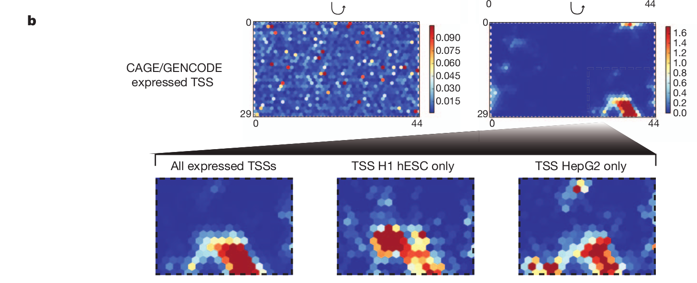

## Dermatology Branch Journal Club

2013-06-14

---

## ENCODE

--- bg:yellow

## ENCODE Pilot Project (2003-2007)
### The ENcyclopedia Of DNA Elements

>- Following release of human genome sequence, April 2003
>- Identify and characterize sequence-based functional elements
   - Experimentally and computationally
>- 35 research groups, 200 data sets
>- Targeted analysis of 30Mb (1% of genome)

---

## Highlights (Nature, Vol 447, 14 June 2007)
### Identification and analysis of functional elements in 1% of the human genome by the ENCODE pilot project
* More transcription than previously identified
* Symmetric distribution of regulatory sequences around TSS's
* Characteristic histone modification patterns
* 5% of genome is under (mammalian) evolutionary constraint
* Many "functional", non-constrained sites (a pool of neutral elements)

---

## Nature Cover

http://circos.ca/documentation/tutorials/recipes/nature_cover_encode/lesson

## 

PLoS Biol. 2011 Apr;9(4):e1001046. doi: 10.1371/journal.pbio.1001046

---

## 

Nature 489, 46–48 (06 September 2012) doi:10.1038/489046a

---

## Histone modifications predict expression

---

## Transcription factor co-association

---

## Data integration and segmentation

---

## Machine learning

---

## ENCODE Results - Machine learning

---

## ENCODE Results - Machine learning

---

## 'Experimental' techniques
### From the 2007 ENCODE pilot project (doi:10.1038/nature05874)
> "In describing the major results and initial conclusions, we seek to distinguish ‘biochemical function’ from ‘biological role’. Biochemical function reflects the direct behaviour of a molecule(s), whereas biological role is used to describe the consequence(s) of this function for the organism.

> Genome-analysis techniques nearly always focus on biochemical function but not necessarily on biological role. This is because the former is more amenable to large scale data-generation methods, whereas the latter is more difficult to assay on a large scale."

--- &twocol

## A rebuttal of ENCODE

*** left

https://twitter.com/DanGraur

*** right

- Every nucleotide has a function
- Somehow, the function is maintained in the absence of selection
- Definition of function is questionable
- Favor sensitivity over specificity

--- .tvbg-slide

## Selected effect vs. causal role

### Selected effect functions are historical and evolutionary
> The sequence "TATAAA" is maintained by natural selection to bind a transcription factor, resulting in the transcription of a gene.
>
>
> The selected effect function is binding a transcription factor.

<!---
Suggests a clear, conservative method for inference for function in DNA sequences; only sequences under selection can be claimed to be functional
--->

### Causal role functions are ahistorical and nonevolutionary

> Example: The sequence "TATAAT" mutates into "TATAAA" and subsequently bind a transcription factor, but does not result in the transcription of a gene.
> The "causal role function" is binding a transcription factor.

<!---
Graur, et al. argue that ENCODE takes this definition; thus, if a region is determined to be functional (by the assays) then no deleterious mutations can occur.
--->

---

## Wrong and inconsistent?
### Function according to ENCODE
- be transcribed, associated with modified histone, located in an open chromatin area, bind a transcription factor or contain methylated CpG dinucleotide

**Are these functions, or simply genomic locations, features/properties related to nucleotide composition?**

### The ENCODE functional argument (affirming the consequent)
1. "Functional" DNA segments tend to display a certain property.
2. A DNA segment displays the same "property."
3. Therefore, the DNA segment is "functional."

### Inconsistent, arbitrary percentages of amount of functional DNA (80%, 40%, 20%,...)

---

## Transcription does not equal function
### Claim: 74.7% of the genome is transcribed
- Conclusion: every observed transcribed DNA is "functional"

<!---
The broadest element class represents the different RNA types, covering 62% of the genome (although the majority is inside of introns or near genes).
--->

### Problems
- Others estimate 90% of transcription is "noise"
- Cell lines used are transcription permissive (<a href='http://encodeproject.org/encode/cellTypes.html'>Cell types</a>)
  - A hallmark of ESC genome: transcriptionally globally hyperactive 
  (<a href="http://www.ncbi.nlm.nih.gov/pmc/articles/PMC2435228/">doi:10.1016/j.stem.2008.03.021</a>)
  - HeLa cells are not representative of human cells (Helacyton gartleri)
- Allows DNA sequences WITHOUT a promoter to be transcribed
- Three major classes of transcribed elements that are not really functional

---

## Transcription does not equal function

### Pseudogenes
- 10% of pseudogenes are transcribed, often translated in tumor cells
- High level of mutations, not under functional constraint (negative selection)
- "Pseudogenes" that have been shown to be functional aren't pseudogenes!

### Introns
- Only 4% of primary transcripts are coding, but ALL transcript bases counted as functional
- 3% introns knocked out with negative growth effect yeast
- Exceptions - splice sites, regulatory elements, mirtrons (small percentage)

<!---
They do concede that introns are counted; though no numbers are given when they are excluded 
--->

### Mobile elements
- LINEs, SINES, retroviruses, transposons
- 2/3 of genome, 1/3 of transcriptome (e.g. Alu elements)
- Only functions are littering and causing frameshifts

---

## (Statistical) transcriptome analysis issues
* A methodological "legedermain"

---

## Histone modification does not equal function
- The "epigenetic code" - methylation, acetylation, phosporylation of histone tails
- How much variation in gene expression is explained by histone modifications?
  - 142 combinations of 3 modifications (out of ~8000); 2% **statistically** significant
- ENCODE assigns function such as "5' end of genes" to H4K20me1

---

## Histone modification patterns
- Using signal processing techniques

## Open chromatin does not equal function
- Defined as genomic DNAase I hypersensitive (DHS), or identified by FAIRE-Seq
  - They are nucleosome depleted
- 2.89 million DHSs (205K/cell type; tier 1, 2)
  - 98.5% of ENCODE ChIP-Seq peaks are in these regions
- 80% of TSSs were in open chromatin regions; two ways to view this:
  - Most TSSs are in open chromatin regions, or
  - Most open chromatin regions are functional TSSs.

<!--- Song et al - "Over 870,000 DNaseI or FAIRE sites, which correspond tightly to nucleosome-depleted regions, were identified across the seven cell lines, covering nearly 9% of the genome"..."Open chromatin common to all seven cell types tended to be at or near transcription start sites and to be coincident with CTCF binding sites, while open chromatin sites found in only one cell type were typically located away from transcription start sites and contained DNA motifs recognized by regulators of cell-type identity." --->

<!--- The protocol is based on the fact that the formaldehyde cross-linking is more efficient in nucleosome-bound DNA than it is in nucleosome-depleted regions of the genome. This method then segregates the non cross-linked DNA that is usually found in open chromatin, which is then sequenced. The protocol consists of cross linking, phenol extraction and sequencing the DNA in aqueous phase. --->

---

## TFBS binding does not equal function
- Applied ChIP-Seq for 119 DNA-binding proteins (87 sequence specific TFs)
- 636K (230Mb; 8.1% of genome) bound regions identified (and counted as functional!)
- Disregard evolutionary conservation
- Other study validates 12/14 Stat3 sites; extrapolating leaves 0.024% of the genome as TFBSs
- High inherent false positive rate (6-14nt sites, degenerate)
- Inflated values based on peak detection methods (600bp window; maybe should be 0.14% of genome)

---

## DNA methylation does not equal function
- Previous work suggests DNA methylation of promoters negatively regulates expression
- Identified 96% of 1.2 million sites are methylated (across 82 cell/tissues types)
- Again, just a chemical property, not a function - most CpG sites are able to be methylated
- A more interesting question: which regions lack CpGs?

<!--- information a bit scarce on overlap across cell/tissue types; 1.2mill is avg across 82 types --->
<!--- CpG sites are selected against - oft mutated, and they neg regulate gene exp --->
<!--- Are CpGs important? Yes! (genomic imprinting, aberrant in cancer, etc) --->

---

## Derived allele frequency and purifying selection
- Evidence for negative selection using 205K ENCODE and 85K non-ENCODE SNPs
- Multiple "technical" errors
  - Modeling genomes as independently derived (probably computational)
  - Choice of regions to identify, manner of sample selection is questionable
- ENCODE samples had 0.02% lower DAF than control regions
  - Large sample size -> statistically significant result
  - But is the magnitude of the effect biologically meaningful?
--

## Junk (or garbage?) DNA
> - Number of putative functional genes decreasing (pre-human genome: 212K; now: 20K)
  - nematode: 20K genes!
> - The semantics of "junk" DNA - junk vs. garbage
  - Potential for function does not equal a function
> - 
## Not all bad
* Useful, extensive resource/dataset
* All data AND CODE are available

