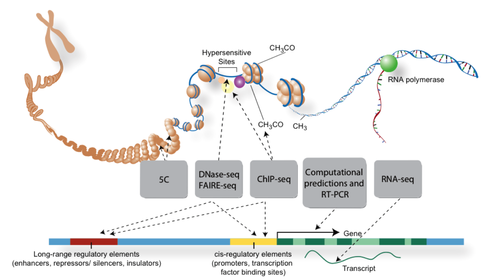
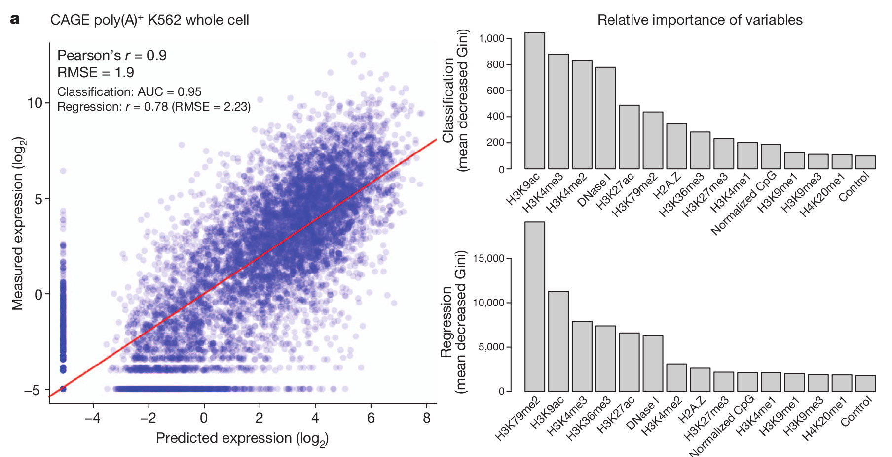
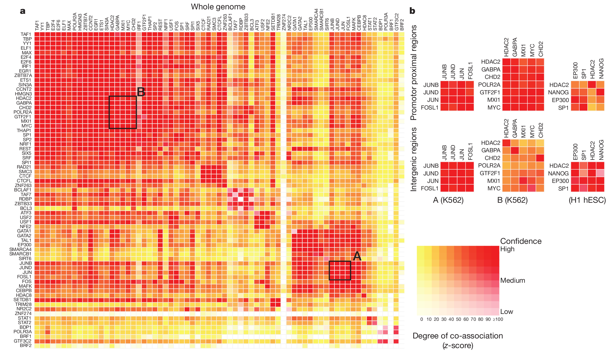
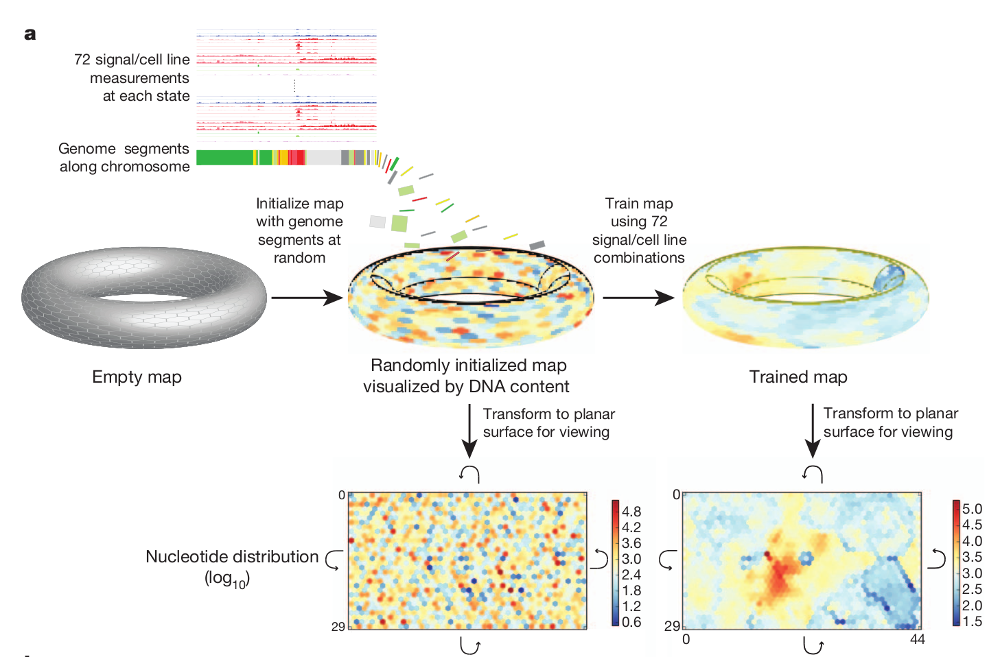
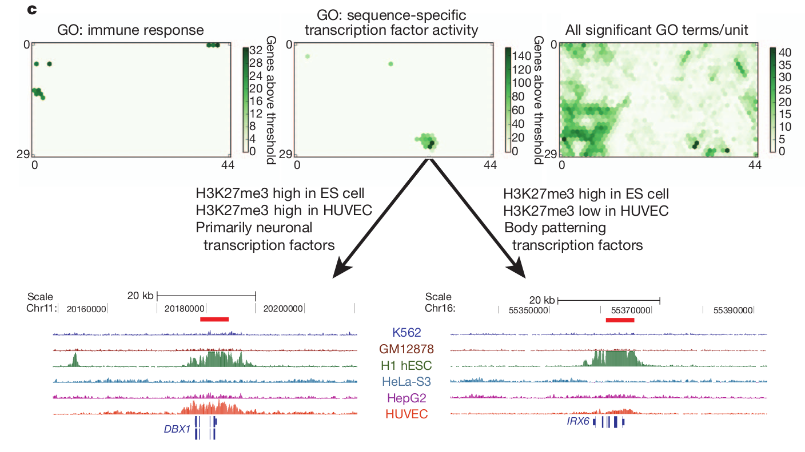

## Dermatology Branch Journal Club

2013-06-14

---

## ENCODE

--- bg:yellow

## ENCODE Pilot Project (2003-2007)
### The ENcyclopedia Of DNA Elements

>- Following release of human genome sequence, April 2003
>- Identify and characterize sequence-based functional elements
   - Experimentally and computationally
>- 35 research groups, 200 data sets
>- Targeted analysis of 30Mb (1% of genome)

---

## Highlights (Nature, Vol 447, 14 June 2007)
### Identification and analysis of functional elements in 1% of the human genome by the ENCODE pilot project
* More transcription than previously identified
* Symmetric distribution of regulatory sequences around TSS's
* Characteristic histone modification patterns
* 5% of genome is under (mammalian) evolutionary constraint
* Many "functional", non-constrained sites (a pool of neutral elements)

---

## Nature Cover

http://circos.ca/documentation/tutorials/recipes/nature_cover_encode/lesson

## 

PLoS Biol. 2011 Apr;9(4):e1001046. doi: 10.1371/journal.pbio.1001046

---

## 

Nature 489, 46–48 (06 September 2012) doi:10.1038/489046a

---

## Histone modifications predict expression

---

## Transcription factor co-association

---

## Data integration and segmentation

---

## Machine learning

---

## ENCODE Results - Machine learning

---

## ENCODE Results - Machine learning

---

## 'Experimental' techniques
### From the 2007 ENCODE pilot project (doi:10.1038/nature05874)
> "In describing the major results and initial conclusions, we seek to distinguish ‘biochemical function’ from ‘biological role’. Biochemical function reflects the direct behaviour of a molecule(s), whereas biological role is used to describe the consequence(s) of this function for the organism.

> Genome-analysis techniques nearly always focus on biochemical function but not necessarily on biological role. This is because the former is more amenable to large scale data-generation methods, whereas the latter is more difficult to assay on a large scale."

--- &twocol

## A rebuttal of ENCODE

*** left

https://twitter.com/DanGraur

*** right

- Every nucleotide has a function
- Somehow, the function is maintained in the absence of selection
- Definition of function is questionable
- Favor sensitivity over specificity

--- .tvbg-slide

## Selected effect vs. causal role

### Selected effect functions are historical and evolutionary
> The sequence "TATAAA" is maintained by natural selection to bind a transcription factor, resulting in the transcription of a gene.
>
>
> The selected effect function is binding a transcription factor.

<!---
Suggests a clear, conservative method for inference for function in DNA sequences; only sequences under selection can be claimed to be functional
--->

### Causal role functions are ahistorical and nonevolutionary

> Example: The sequence "TATAAT" mutates into "TATAAA" and subsequently bind a transcription factor, but does not result in the transcription of a gene.
> The "causal role function" is binding a transcription factor.

<!---
Graur, et al. argue that ENCODE takes this definition; thus, if a region is determined to be functional (by the assays) then no deleterious mutations can occur.
--->

---

## Wrong and inconsistent?
### Function according to ENCODE
- be transcribed, associated with modified histone, located in an open chromatin area, bind a transcription factor or contain methylated CpG dinucleotide

**Are these functions, or simply genomic locations, features/properties related to nucleotide composition?**

### The ENCODE functional argument (affirming the consequent)
1. "Functional" DNA segments tend to display a certain property.
2. A DNA segment displays the same "property."
3. Therefore, the DNA segment is "functional."

### Inconsistent, arbitrary percentages of amount of functional DNA (80%, 40%, 20%,...)

---

## Transcription does not equal function
### Claim: 74.7% of the genome is transcribed
- Conclusion: every observed transcribed DNA is "functional"

<!---
The broadest element class represents the different RNA types, covering 62% of the genome (although the majority is inside of introns or near genes).
--->

### Problems
- Others estimate 90% of transcription is "noise"
- Cell lines used are transcription permissive (<a href='http://encodeproject.org/encode/cellTypes.html'>Cell types</a>)
  - A hallmark of ESC genome: transcriptionally globally hyperactive 
  (<a href="http://www.ncbi.nlm.nih.gov/pmc/articles/PMC2435228/">doi:10.1016/j.stem.2008.03.021</a>)
  - HeLa cells are not representative of human cells (Helacyton gartleri)
- Allows DNA sequences WITHOUT a promoter to be transcribed
- Three major classes of transcribed elements that are not really functional

---

## Transcription does not equal function

### Pseudogenes
- 10% of pseudogenes are transcribed, often translated in tumor cells
- High level of mutations, not under functional constraint (negative selection)
- "Pseudogenes" that have been shown to be functional aren't pseudogenes!

### Introns
- Only 4% of primary transcripts are coding, but ALL transcript bases counted as functional
- 3% introns knocked out with negative growth effect yeast
- Exceptions - splice sites, regulatory elements, mirtrons (small percentage)

<!---
They do concede that introns are counted; though no numbers are given when they are excluded 
--->

### Mobile elements
- LINEs, SINES, retroviruses, transposons
- 2/3 of genome, 1/3 of transcriptome (e.g. Alu elements)
- Only functions are littering and causing frameshifts

---

## (Statistical) transcriptome analysis issues
* A methodological "legedermain"

---

## Histone modification does not equal function

---

## Open chromatin does not equal function

---

## TFBS binding does not equal function

---

## DNA methylation does not equal function

---

## Derived allele frequency and purifying selection

--

## Junk (or garbage?) DNA

## Not all bad
* Useful, extensive resource/dataset
* All data AND CODE are available

